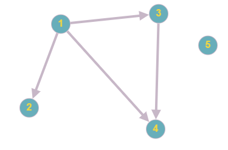
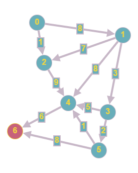
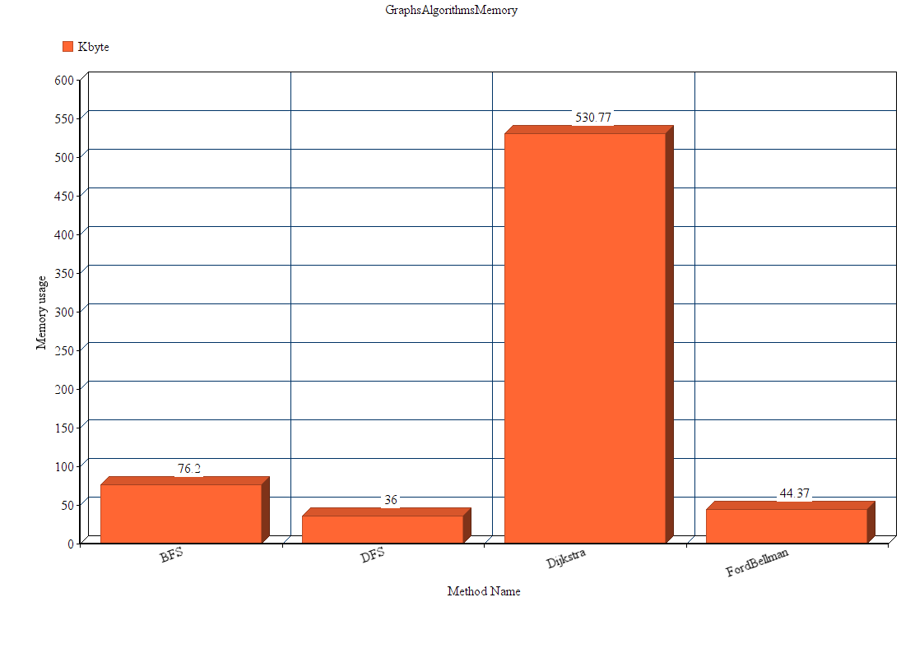
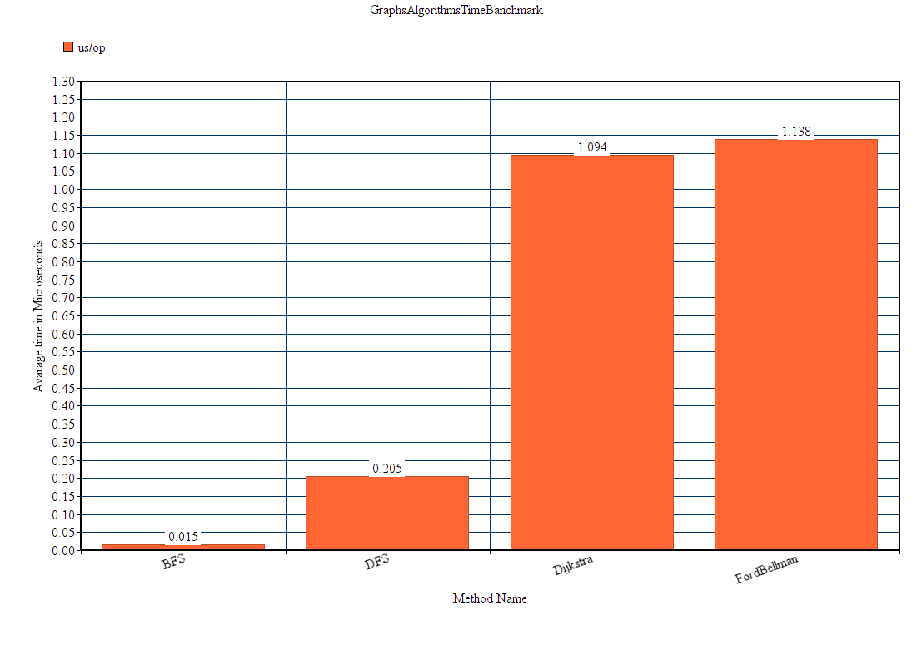
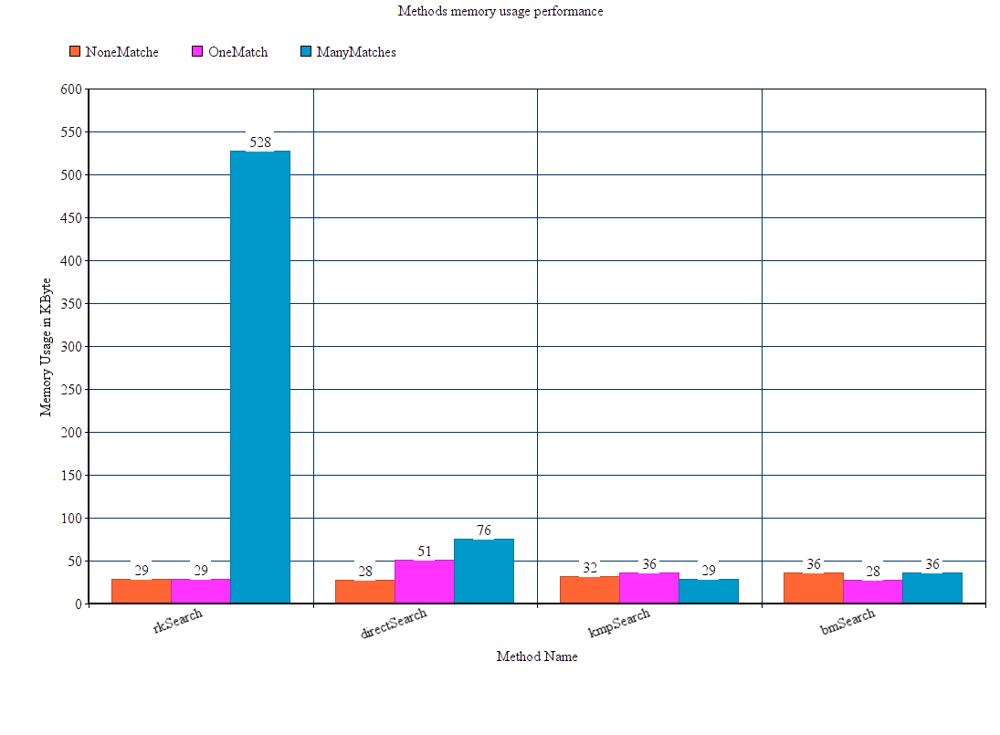
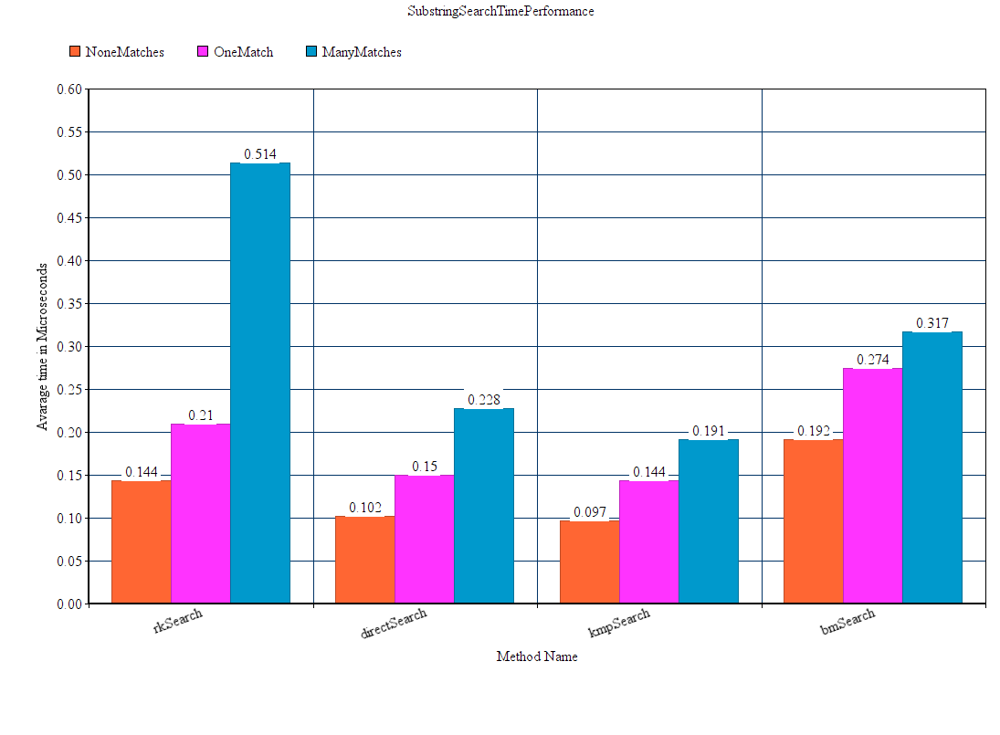

## Graph1 image
  
## Graph2 image 
  
## Bench search substring in string results [log file](results/SearchStringBenchRESULTS.txt)
## Path finding graphs algorithms bench results [log file](results/GraphsAlgorithmsBenchResults.txt)
## Used algorithms for finding a substring in a string [url link](https://habr.com/ru/post/111449)
## The algorithms used to find the path in the graph
### Поиск в ширину (BFS, Breadth-First Search)
Алгоритм был разработан независимо Муром и Ли для разных приложений (поиск пути в лабиринте и разводка проводников соответственно) в 1959 и 1961 годах. Этот алгоритм можно сравнить с поджиганием соседних вершин графа: сначала мы зажигаем одну вершину (ту, из которой начинаем путь), а затем огонь за один элементарный промежуток времени перекидывается на все соседние с ней не горящие вершины. В последствие то же происходит со всеми подожженными вершинами. Таким образом, огонь распространяется «в ширину». В результате его работы будет найден кратчайший путь до нужной клетки.
### Алгоритм Дейкстры (Dijkstra)
Этот алгоритм назван по имени создателя и был разработан в 1959 году. В процессе выполнения алгоритм проверит каждую из вершин графа, и найдет кратчайший путь до исходной вершины. Стандартная реализация работает на взвешенном графе — графе, у которого каждый путь имеет вес, т.е. «стоимость», которую надо будет «заплатить», чтобы перейти по этому ребру. При этом в стандартной реализации веса неотрицательны. На клетчатом поле вес каждого ребра графа принимается одинаковым (например, единицей).
### Алгоритм Форда-Беллмана
Находит расстояние от одной вершины (дадим ей номер 0) до всех остальных за количество операций порядка n * m. Аналогично предыдущему алгоритму, веса могут быть отрицательными, но у нас не может быть циклов с отрицательной суммой весов рёбер.
Заведём массив d[0… n — 1], в котором на i-ой итерации будем хранить ответ на исходную задачу с ограничением на то, что в путь должно входить строго меньше i рёбер. Если таких путей до вершины j нет, то d[j] = 2000000000 (это должна быть какая-то недостижимая константа, «бесконечность»). В самом начале d заполнен 2000000000. Чтобы обновлять на i-ой итерации массив, надо просто пройти по каждому ребру и попробовать улучшить расстояние до вершин, которые оно соединяет. Кратчайшие пути не содержат циклов, так как все циклы неотрицательны, и мы можем убрать цикл из путя, при этом длина пути не ухудшится (хочется также отметить, что именно так можно найти отрицательные циклы в графе: надо сделать ещё одну итерацию и посмотреть, не улучшилось ли расстояние до какой-нибудь вершины). Поэтому длина кратчайшего пути не больше n — 1, значит, после n-ой итерации d будет ответом на задачу.
n итераций по m итераций, итого порядка n * m операций.
### Поиск в глубину
DFS следует концепции «погружайся глубже, головой вперед» («go deep, head first»). Идея заключается в том, что мы двигаемся от начальной вершины (точки, места) в определенном направлении (по определенному пути) до тех пор, пока не достигнем конца пути или пункта назначения (искомой вершины). Если мы достигли конца пути, но он не является пунктом назначения, то мы возвращаемся назад (к точке разветвления или расхождения путей) и идем по другому маршруту.

#Benchmark results

